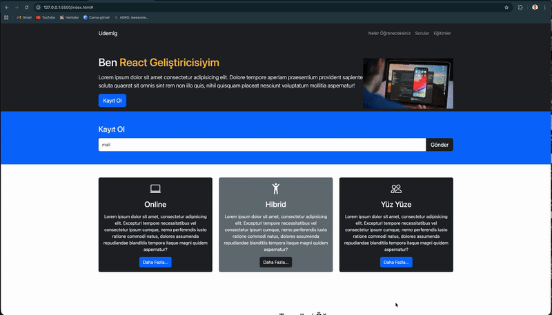
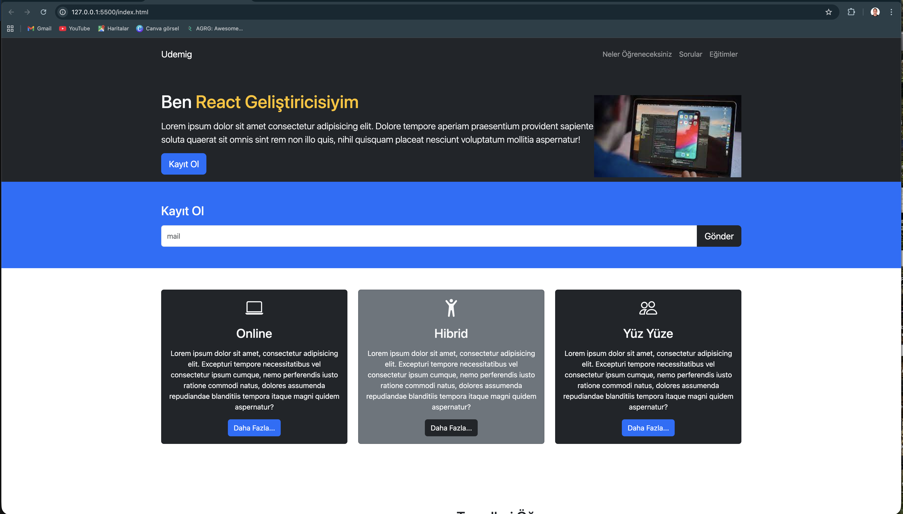
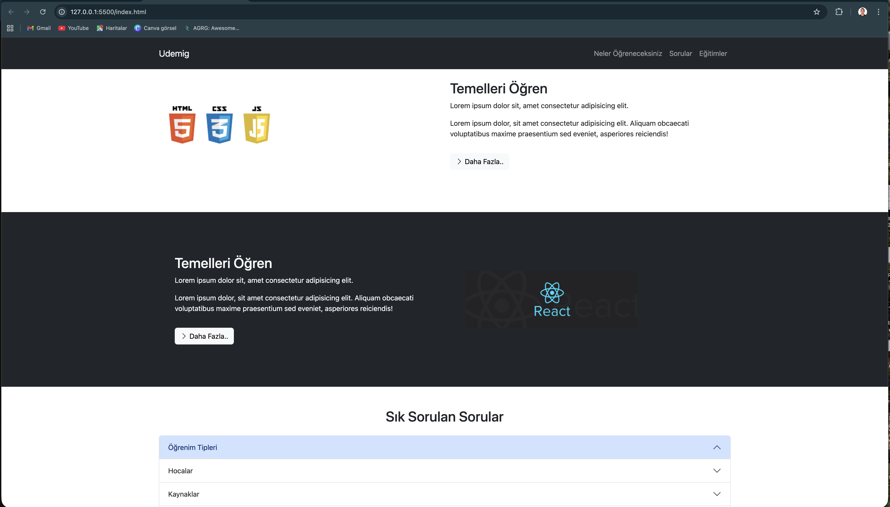
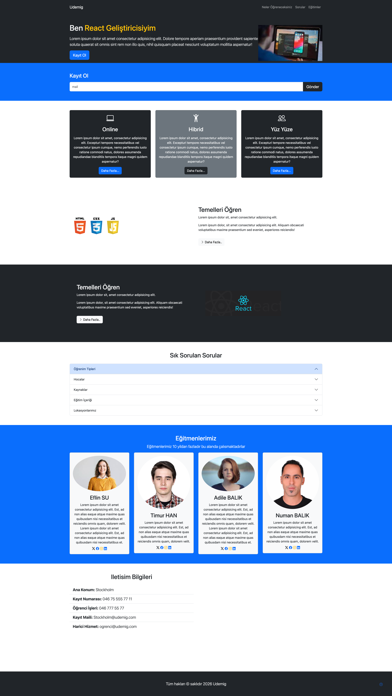

# ⚛️ Udemig React Web

Modern ve responsive bir frontend web projesi.  
Bu proje **HTML & CSS** kullanılarak geliştirilmiştir.

Amaç: temiz yapı, düzenli CSS, responsive düzen ve GitHub üzerinde profesyonel sunum. ✅

---
## 🙏 Teşekkür

Bu projede rehberliği ve katkıları için **https://github.com/Udemig** ekibine teşekkür ederim.  
Özellikle **https://github.com/isveckrali**’a; mentorluk, yönlendirme ve teknik bakış açımı geliştiren desteği için ayrıca teşekkür ederim. 🙌

## 📌 Proje Özeti

**udemigreact-web**, eğitim sürecinde geliştirilmiş bir web arayüz çalışmasıdır.  
Projede odaklandığım noktalar:

- ✅ Semantik HTML yapısı
- ✅ Düzenli ve okunabilir CSS
- ✅ Responsive tasarım yaklaşımı
- ✅ Temiz klasör organizasyonu
- ✅ Demo & ekran görüntüleri ile profesyonel README sunumu

---

## 🎥 Demo Video

Aşağıdaki GIF, projenin genel akışını ve arayüz davranışını gösterir:

---

## 🖼️ Ekran Görüntüleri

### 🏠 Ana Görünüm
Arayüzün genel yerleşimi ve ilk izlenim.

---

### 📦 İçerik / Bölüm Yapısı
Düzenli bloklar, spacing ve görsel hiyerarşi.

---

### 🔍 Detay Görünüm
Responsive uyum ve tasarım bütünlüğünü gösteren görünüm.

---

## 🛠 Kullanılan Teknolojiler

- 🟠 **HTML5** (semantic & structured markup)
- 🔵 **CSS3** (layout, styling, responsive design)
- 🟣 **Git & GitHub** (version control & repo management)

---

## 📂 Proje Yapısı
---

## 🎯 Amaç

Bu proje ile:

- HTML & CSS pratiklerimi güçlendirdim
- Responsive tasarım uyguladım
- Proje düzeni ve sunum disiplinimi geliştirdim
- GitHub portföyümü daha profesyonel hale getirdim

---
---

### 🖥️ Full Page View
Tüm sayfanın genel görünümü.

---

## 👤 İletişim

**Numan Balık**

- 🐙 GitHub: https://github.com/numanbalik-web  
- 💼 LinkedIn: https://www.linkedin.com/in/numan-balik-sverige  
- 📧 Email: numanbalik72@gmail.com  

---

⭐ Projeyi faydalı bulduysan yıldız vermeyi düşünebilirsin.
